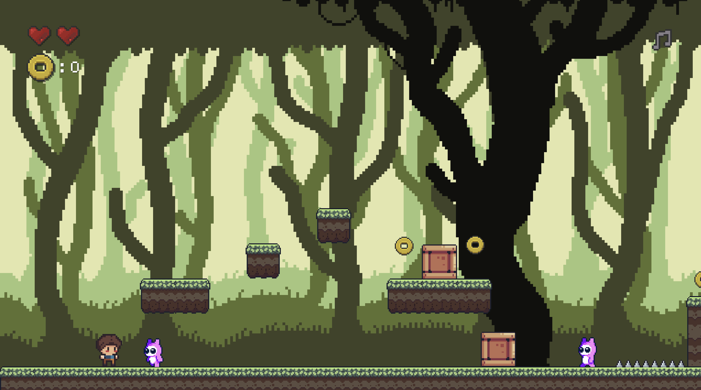

# LUA and Love2D: First Steps for a Platformer 2D

## ⭐️ Features

- ⚛️ Physics (Gravity, acceleration, mass) thanks to Box2D and Love2D
- 💕 Health system (3 lives max)
- 👾 Simple Enemy
- 🏞️ Setup handling using Tiled (solid objects, coins, spikes and enemies)
- 🏞️ Change levels

 

## 🔧 Setup

Just need to run `love .` inside the folder.
(You need to have [love2D working properly](https://love2d.org/))

## 🤷🏻‍♂️ Copyright/Assets

- Hero, Background and platforms are mine, and you can use them wherever you want without mentioning, I made them by following some tutorials on the Internet.
- Box, Spikes and the enemies are free assets found on itch.io that do not require any attribution.
