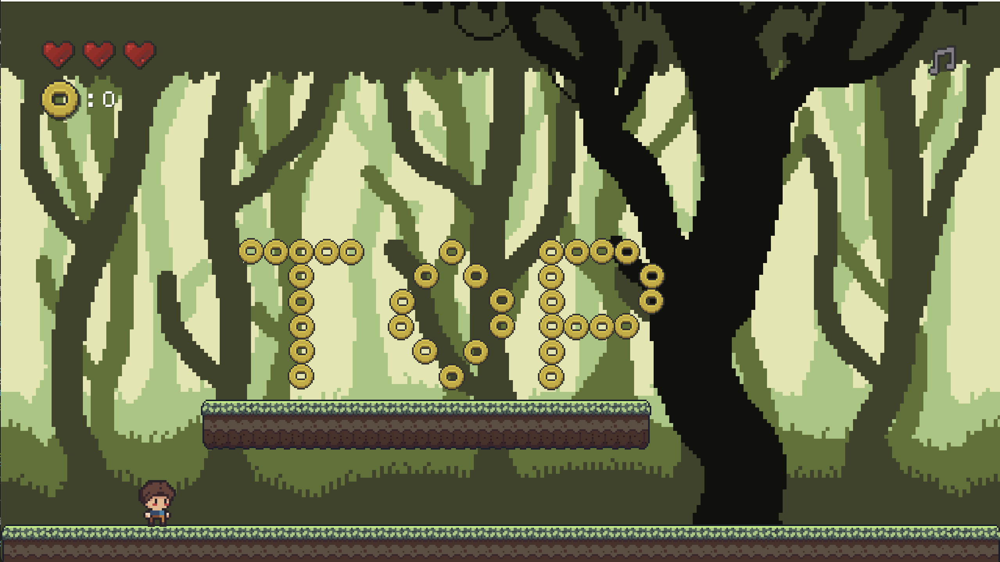

# LUA and Love2D: First Steps for a Platformer 2D

Check out the live version [here](https://love2d-rpg-platform.netlify.app/)

## ⭐️ Features

- ⚛️ Physics (Gravity, acceleration, mass) thanks to Box2D and Love2D
- 💕 Health system (3 lives max)
- 👾 Simple Enemy
- 🎵 SFX and background music
- 🏞️ Setup handling using Tiled (solid objects, coins, spikes and enemies)
- 🔝 Change levels

 

## 🔧 Setup

Just need to run `love .` inside the folder.
(You need to have [love2D working properly](https://love2d.org/))

## 🤷🏻‍♂️ Copyright/Assets

- Hero, Background and platforms are mine, and you can use them wherever you want without mentioning, I made them by following some tutorials on the Internet.
- Box, Spikes and the enemies are free assets found on itch.io that do not require any attribution.

## 🚀 Deploy with Love.js

It worked for Love 10.0, I have been using 11.5, so I had to make some changes in the colors (1 = 255) and take care of the width (the calculation for the position of the music button was not done properly).

We need Python 2.7 and Love 10 downloaded from the already archived https://github.com/TannerRogalsky/love.js/tree/master.
It would be great to check how to do it with the version of Davidobot for higher versions of Love2D: https://github.com/Davidobot/love.js
This command is essential and we will do it in the folder `debug` after having copied the repo that we want to deploy.
Note that we are using `@/` after the name of the project.
`python ../emscripten/tools/file_packager.py game.data --preload lua-love2d-platformer@/ --js-output=game.js`

With this command you open a server with python for the folder we are. We can do it in `debug` to test.
`python -m SimpleHTTPServer 4444`

And then we will add both new files: `game.data` and `game.js` to the folder `release-compatibility` and that is what we will upload to the server. Actually we can even further style everything inside that folder to make it cooler (I added TailwindCSS for example)
